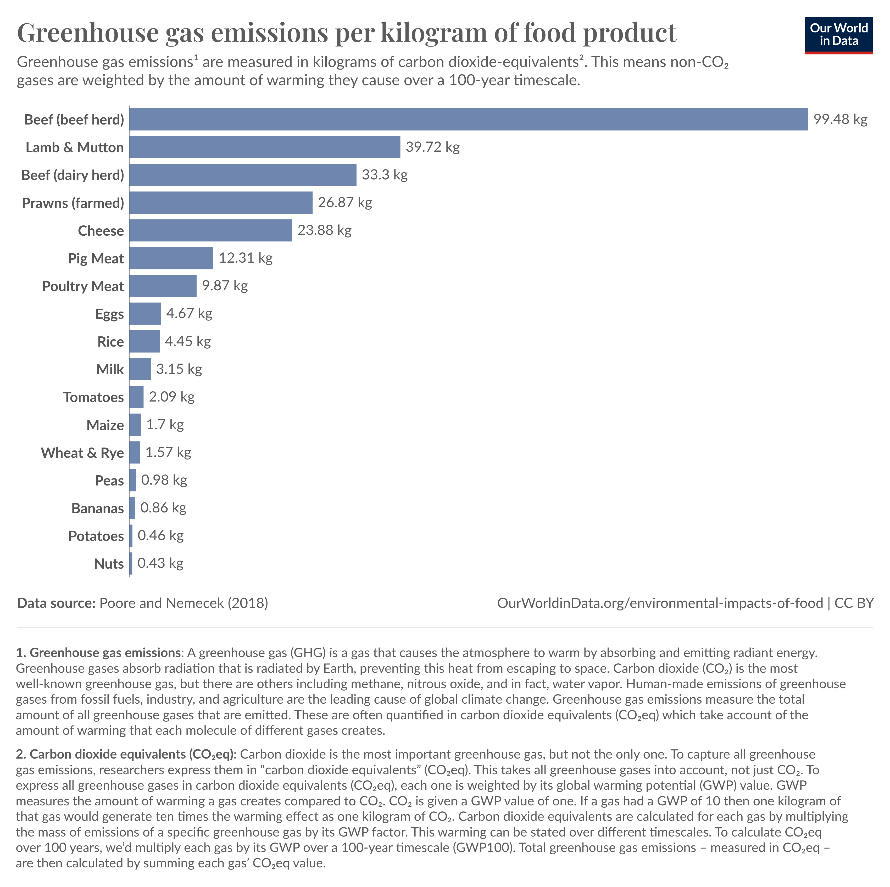

# New Experiences & Changing Perspectives
###### Why I’ve Decided to Pursue a Career in Climate Change and Food Systems

I want to start by expressing my gratitude to everyone who has supported me during my time in computer engineering. This change is not a reflection of any dissatisfaction with the time and support I've received, but rather the result of personal experiences, as outlined below, that have shifted my perspective and priorities.

## Moving Out
Two and a half years ago, I moved to Norway after graduating with a first-class honours in Computer and Communications Engineering. This marked many firsts for me—including my first time moving out and all that comes with it. Until then, whether you consider it fortunate or unfortunate, I hadn’t had to do much grocery shopping or meal planning myself. Suddenly, it was a requirement, and was the first in a series of events that have led me to making this change.

I had previously been only slightly aware of where my food came from, mainly in terms of country of origin and fairtrade certification. But once I was choosing and cooking everything myself, I became more conscious of what I was buying and the waste that came with it. Initially, I leaned towards vegetarian cooking mostly for convenience as it avoids the contamination issues with raw poultry and it was cheaper than high quality beef or pork. And without cooking habits already centred around meat dishes, plant-based cooking was a pretty easy change. However, I've since learnt of the [environmental impacts of livestock systems](https://ourworldindata.org/explorers/food-footprints?facet=none&country=Bananas~Beef+%28beef+herd%29~Beef+%28dairy+herd%29~Cheese~Eggs~Lamb+%26+Mutton~Milk~Maize~Nuts~Pig+Meat~Peas~Potatoes~Poultry+Meat~Rice~Tomatoes~Wheat+%26+Rye~Tofu+%28soybeans%29~Prawns+%28farmed%29&hideControls=false&Commodity+or+Specific+Food+Product=Commodity&Environmental+Impact=Carbon+footprint&Kilogram+%2F+Protein+%2F+Calories=Per+kilogram&By+stage+of+supply+chain=false), offering a more compelling reason to cut consumption of animal products.

*Greenhouse gas emissions per kilogram of food product - Our World in Data*

## My Introduction to Food Waste
Soon after, I came across [*Wasted*](https://blastabooks.com/products/blasta-books-7-wasted) by chef [Conor Spacey](https://www.conorspacey.com/), a small cookbook that soon became a kitchen staple. It didn’t just offer recipes; it also provided suggestions for alternatives to try. Though not fully fleshed out, these suggestions encouraged me to go beyond the book and question how else I could use all parts of an ingredient and reduce my food waste.

I wasn't aware at the time but later found the statistics around food waste to be quite shocking, showcasing one of the many broken aspects of our global food systems. For those interested: around [20% of all food produced ends up as waste](https://www.epa.ie/our-services/monitoring--assessment/waste/national-waste-statistics/food/), with [54% of that waste generated in the home](https://food.ec.europa.eu/food-safety/food-waste_en). This becomes even more concerning when you consider that [~30% of global emissions come from food production systems](https://ourworldindata.org/greenhouse-gas-emissions-food), while at the same time, around 10% of the population in both the [UK](https://commonslibrary.parliament.uk/research-briefings/cbp-9209/) and [Ireland](https://assets.gov.ie/230064/065ff541-d304-4bd6-8f4b-16ceb0b67fdb.pdf) are facing food poverty.

*Wasted by Conor Spacey, published by Blasta Books*

## Discovering Irish Food Production
Around this time, I was also tuning into Irish radio on the weekends as a connection to back home. At this point, I'd had little interest in agriculture, but hearing the reports and interviews on [*CountryWide*](https://www.rte.ie/radio/radio1/countrywide/), every Saturday morning, of the challenges facing farmers in an incresingly unpredictable climate and the pressures from supermarkets and lower cost imports, drew my attention to the topic. There were also discussions around the impact on climate of the huge beef and dairy industry in Ireland and perspectives from farmers who had moved to more sustainable practices despite a lack of government support, driven by their own sense of responsibility. Two stories in particular really stuck with me ([*Home grown vegetables face competition*](https://www.rte.ie/radio/radio1/clips/22363299/); [*The Demise of The Vegetable Farmers*](https://www.rte.ie/radio/radio1/clips/22253182/)), in which farmers around the country were walking away from fields of 1000's of crops ready for harvest after a year spent growing them, simply because the price offered by supermarkets was not worth their time. This only begins to show the lack of value consumers put on food.

## Exploring Food in Society
At the same time, I began listening to BBC's [*The Food Programme*](https://www.bbc.co.uk/programmes/b006qnx3), which delves into food from a more holistic perspective, investigating the cultural and socioeconomic aspects as well the systems behind food production and consumption. These stories reveal some of the many complex connections within our food systems and often highlight issues such as growing food poverty and the disconnect between consumers and their food. In the episode [*Feeding Norfolk*](https://www.bbc.co.uk/programmes/m001wxpl), which focuses on initiatives tackling food poverty in Norfolk, there is one particular moment which stood out to me (~23min into the episode). A food grower donating to the a local support hub had school children come down to farm to dig their own onions, carrots and potatoes. She describes how, as the potatoes came out of the ground, one child exclaimed "Oh, yuck! These are disgusting!", however after bringing them back to farmhouse to wash and prepare them as wedges, the child ate three helpings. This exemplified to me, the huge disconnect so many people have between farming and food, especially in poorer areas where the cheapest, most accessible food is often highly processed and bears little resemblance to 'real' food. This is but one example and not to mention the social norm in urban areas where intense advertising of cheap, highly palatable, ultra processed foods often targets children and young people. **How can we expect consumers to support a more sustainable food system when they lack the awareness or financial means to do so?**

*Another memorable episode is ["Local Food – is it working?"](https://www.bbc.co.uk/sounds/play/m001r15g); discussing localised food systems from many perspectives.*

## Learning from Local Producers
Last December, I attended an open farm day at a small [family farm](https://reppesondre.com/), just a 20-minute bus ride from my apartment. There, I met Lars, who grows rye, spelt, and a landrace wheat. As a keen bread baker (something else I picked up after moving to Norway), I found it fascinating to learn about his work. He showed me the grain fields, the shed where he dries the grains after harvest, and the mill—all on site. They also raise chickens and Grey Trøndersk sheep, while running cooperative and school farming initiatives to engage the community and introduce children to growing their own food.

The farm also facilitates the [Dype Røtter](https://dyperoetter.org/) social enterprise, a project run by Andy Ross, whom I first met at the farm café he operates, in addition to growing fruit and vegetables using regenerative practices. The café primarily uses their own and other local produce and they also work with refugees in the garden and café, supporting their integration into the community. This experience really highlighted for me the positive impact that sustainable, community-oriented food supply chains can have.

*Colours from the market garden - dyperoetter.org*

I then joined the local [REKO-ring](https://www.rekonorge.no/), a network that connects local producers and consumers for pre-ordered, bi-weekly collection, all over Norway. Through this, I began doing most of my shopping with local producers. I also gained a deeper awareness of the struggles local producers face in competing with supermarkets imports, and the vulnerabilities of a food system reliant on global supply chains. Seeing parallels with the situation back home, I became increasingly frustrated by the lack of support for local producers and the pressures driving unsustainable agricultural practices. The loss of local producers significantly threatens food security in an increasingly unpredictable world, both environmentally and politically. This was clearly shown when [wheat prices jumped in response to Russias invasion of Ukraine in 2022](https://www.sciencedirect.com/science/article/abs/pii/S0305750X23002140), and the [4% drop in milk production in Ireland in 2023, in part due to unforseen weather conditions—the first such decline since the EU lifted milk quotas in 2015](https://nationalmilkagency.ie/wp-content/uploads/2024/08/NMA-Annual-Report-2023-EN.pdf).

*Impacts of the Russian invasion of Ukraine on the global wheat market - S. Devadoss, W. Ridley*

## Back to Engineering & Moving Home
In contrast to all of this, my day-to-day work as an engineer began to feel insignificant and in some ways counter to these urgent problems. While my worke contributed to technological advancements, with our chips being used in devices improving quality of life and healthcare, among other things, the bottom line was still to sell billions of chips, many of which would go into devices ultimately ending up as e-waste or used to drive consumption. I began to question the environmental impact of the work I was contributing to.

Moving home from Norway in June 2024, I decided to pursue a master’s in computer and electronics engineering, with the aim of being able to develop my engineering skills to contribute to more sustainable practices. However, 8 weeks in and I felt a deep misalignment with the underlying themes of many of my classes. One class I found wholely inspiring was Energy Systems Decarbonisation and after reading [*Our Renewable Future*](https://richardheinberg.com/bookshelf/our-renewable-future) as part of the class, I began to understand that technology cannot solve the issues we face around climate change-that it requires fundamental changes in societal structures and consumer behaviour. I also found myself far more engaged with the university’s Green Committee and the Climate Action and Sustainable Living society than with my coursework. Eventually, on November 5th, I withdrew from my master’s program to commit fully to directly working on these problems.

## Reassurance & Inspiration

Feeling a bit lost last week, while trying to clearly identify the next steps, I attended a number of talks at the [Samhain Food and Culture Festival](https://foodcultureireland.ie/samhain/) in Kells. One panel discussion featured chef Conor Spacey (remember him from earlier?), national icon Darina Allen, PhD Micehelle Darmody and home economics teacher Stacey Smith. They spoke passionately about engaging young children with food systems—prompting kids to question where their food comes from, while sparking excitement around growing and cooking. As well as sharing their frustrations with wide spread adoption and the need further government policies to drive this. They each shared inspiring insights drawn from their own experiences. 

Later, I listened to George Lamb, of [Wildfarmed](https://wildfarmed.com/), who is driving a regenerative agriculture movement in the UK around wheat production and has recently seen increasing success in the mainstream market. He discussed their goal to become the gold standard for regenerative wheat production, the challenges they faced getting farmers on board, and in gaining partnerships with mainstream retailers. The day finished with a fantastic talk by Philip Boucher Hayes, presenter of *CountryWide*, among other things, where he explored what Ireland's food system might look like in the context of the latest climate projections driving home the scale and urgency of the issue.

Hearing from all of these influential voices on the topic, especially those who first brought my attention to these issues, reaffirmed my confidence in the decision to pursue this change. 

## What's Next?

To build strong foundational knowledge and prepare for a master’s program next September, I’m starting with two microcredentials at UCC and UCD, in [climate change](https://www.ucc.ie/en/ce6053/) and [global food systems](https://www.ucd.ie/microcredentials/explorecourses/foodandnutrition/global-food-systems/). In addition, I'm excited to be taking part in the [STAND Changemakers Academy](https://stand.ie/what-we-do/stand-changemakers-academy) over the next 5 months where I hope to learn to better analyse the systems and root causes behind global issues, and to develop skills in collective leadership and advocacy. 

In the meantime, I’d love to gain some hands-on experience in community organising, policy work, or advocacy, whether through employment, internships, or shadowing. If anyone in my network has connections or suggestions in these areas, I’d be incredibly grateful to [connect](https://www.linkedin.com/in/pierce-lowe/) as I step into this new field.

---

*End Note: This piece focuses on Northern European, specifically Irish and Norwegian, agri-food systems, and doesn’t address the significant challenges within global food supply chains, such as labor exploitation, deforestation, and habitat destruction—especially concerning ultra-processed foods and livestock feed. My perspective here is personal, though I am aware of these larger issues. I believe that by reducing reliance on damaging global systems and supporting local, regenerative practices through consumer choices and community growing initiatives we can contribute to more sustainable solutions. Maybe I’ll explore these topics another time.*

